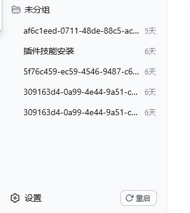
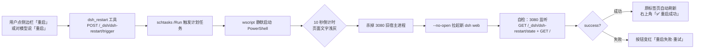

# DSH Restart Plugin

[](LICENSE) [](https://github.com/lnyuqian/dsh-restart-plugin) [](https://github.com/lnyuqian/dsh-restart-plugin)

🌏 [简体中文](README.md) · [English](README_EN.md)

一键重启 DeepSeek Harness Web（`127.0.0.1:3080`）：侧边栏一个按钮，10 秒倒计时，自动完成「杀旧进程 → 拉起新实例 → 自检 → 原页面刷新」。从"打开终端、记步骤、赌运气"变成"点一下、等 10 秒、看结果"。

- **全程无弹窗** — wscript 静默启动，桌面不出现任何 PowerShell 命令行窗口
- **无终端操作** — 无需开终端 / 任务管理器找 PID / 手敲命令
- **不开新标签页** — 重启拉起不触发浏览器新页，由原标签页自动刷新收尾

## 痛点：没有这个按钮时，重启一次有多麻烦

DSH Web 是常驻宿主进程，改插件、改配置、装新 bundle 后都必须重启才生效——而"重启得好"常常也是一切疑难杂症的答案。但每一次重启，都要走一串手工步骤：

1. 打开终端或任务管理器，从 3080 端口反查宿主 PID；
2. 手动 `Stop-Process` 杀掉它（PID 每次不同，杀错有风险）；
3. 找到启动脚本、重新拉起服务；
4. 干等几秒，轮询端口确认监听成功；
5. 验证插件路由真的加载了（如 `/_dsh/dsh-restart/state`），才算重启"成功"；
6. 浏览器里手动刷新页面，甚至被迫接受一个新开的标签页。

全程 5~8 步、牵扯多个窗口，过程中**零反馈**——不知道进行到哪一步、也不知道失败没有。步骤越多越容易出错，而每次出错都要从头再来。

## 解决方案：一键完成全部

这个插件把整条链路收敛成一个侧边栏按钮：



- **双态按钮**：展开态在「设置」右侧显示 [↻ 重启]；收起态在设置齿轮正上方显示圆形 ↻ 图标，随侧边栏实时同步、动画跟手；
- **点击即走**：触发 10 秒倒计时，页面文字整体变浅灰作为进行中反馈（按钮自身保持醒目原色）；
- **全自动执行**：计划任务静默杀旧进程 → 拉起新实例 → 自检（3080 监听 + `GET /_dsh/dsh-restart/state` + `GET /`）；
- **原页面收尾**：自检成功后原标签页自动刷新，右上角弹出绿色「✅ 重启成功」提示；失败则按钮变红，可一键重试；
- **模型也能触发**：对话里说「重启」即可（`dsh_restart` 工具），适合当前回合需要收尾的场景。

## ✨ 特性

- 双态侧边栏按钮（展开文字 / 收起图标），React 重渲染不掉、收起展开跟手不偏移
- 10 秒倒计时 + 页面文字浅灰 + 按钮状态机（重启中 / 失败重试）
- 静默启动：**无弹窗、无终端、不开新标签页**，原页面自动刷新
- 自检驱动：端口 + 插件路由双重验证，成功才提示，失败可重试
- 对话触发：`dsh_restart` 工具（模型侧）

## 🚀 安装

本插件由**两部分**组成，缺一不可：

1. **插件包**（本仓库）——client 侧边栏按钮 + host `/_dsh/dsh-restart/state|trigger` 路由与 `dsh_restart` 工具；
2. **重启脚本链**——真正的"杀进程 → 拉起 → 自检"落在 3 个本地脚本（`.ps1` / `.vbs` / `.bat`）+ 1 个计划任务上，**不在 npm 包里**，由仓库 `docs/setup/` 提供可复刻模板。

> **路径约定**：README 中的 `InstallDir`（脚本部署目录）与命令示例均为通用写法，请按你的本机目录替换；`dsh plugin --profile web` 相关命令作用于 DSH web profile（`~/.dsh/profiles/web`）。

### 前置条件

| 条件 | 说明 |
|---|---|
| 操作系统 | **仅 Windows**（host 端依赖 `schtasks` / `wscript` / PowerShell，Linux / macOS 不适用） |
| DSH Web | 已安装 `@deepseek-ai/dsh` 并能 `dsh web` 启动（0.1.0-rc.x） |
| Node.js | ≥ 24.11（`package.json` engines；用 DSH 随附的 Node 即可） |
| 权限 | 当前用户可创建计划任务（普通用户默认可为自己的账户建任务） |
| 可选 | 无（自检探针用插件自身的 `/_dsh/dsh-restart/state` 路由，不依赖任何第三方插件） |

### 第 1 步：注册插件包

```powershell
# 方式 A：克隆到本地，用 link: 协议注册（推荐，便于后续改代码/host 常量）
git clone https://github.com/lnyuqian/dsh-restart-plugin.git
dsh plugin --profile web add link:.\dsh-restart-plugin

# 方式 B：不 clone，直接从 GitHub 安装
dsh plugin --profile web add git+https://github.com/lnyuqian/dsh-restart-plugin.git
```

`dsh plugin --profile web <子命令>` 等价于在 `~/.dsh/profiles/web`（DSH web profile）里执行 `pnpm <子命令>`；`add link:<目录>` 用 pnpm 的 `link:` 协议把本地目录注册为该 profile 的依赖。注册完成后：

1. 停掉正在运行的 dsh web；
2. 重新 `dsh web` 启动；
3. 浏览器打开 `http://127.0.0.1:3080`，按 **Ctrl+Shift+R** 硬刷新。

此时应能看到：侧边栏出现重启按钮、`http://127.0.0.1:3080/_dsh/dsh-restart/state` 返回 `{"ok":true,...}`、对话工具列表出现 `dsh_restart`。**但此时点按钮/调工具会失败**——计划任务还不存在，继续第 2 步。

> 若按钮未出现（client bundle 未重建）：在 DSH 源码树跑 `pnpm run dev:web`（或对应构建命令）重建 web artifacts 后重启。

### 第 2 步：部署重启脚本链（一键）

```powershell
cd dsh-restart-plugin
powershell -ExecutionPolicy Bypass -File docs\setup\install.ps1 `
  -InstallDir "$env:USERPROFILE\.dsh-restart" -Seconds 10
```

`install.ps1` 自动完成三件事：

1. 把 `docs/setup/` 的 3 个模板复制到 `-InstallDir`，并把所有占位符替换成你的实际路径——`.ps1` 保存为 **UTF-8 带 BOM**（PowerShell 5.1 也能正确读取），`.vbs` / `.bat` 保存为 **GBK**（中文路径下 cmd/wscript 按系统 ANSI 解析正确）；
2. 注册计划任务（默认名 `dsh-web-restart-20s`，Action 为 `wscript.exe "…\restart-dsh-web-silent.vbs"`，wscript 静默启动保证桌面无窗口）；
3. 把 `lib/index.js` 顶部的 `LIVE` / `STATUS` / `TASK` / `SECONDS` / `cwd`（以及 `dsh_restart` 工具描述里的路径文案）自动 patch 成你的路径，原文件备份为 `lib/index.js.bak`。

常用参数：`-InstallDir`（脚本存放目录）、`-Seconds`（倒计时秒数，默认 10）、`-TaskName`（计划任务名）、`-SkipIndexJsPatch`（跳过改 index.js）、`-PluginDir`（仓库根目录，默认自动探测）。

<details>
<summary><b>第 2 步（备选）：手工部署</b></summary>

**（1）复制模板并替换占位符**：把 `docs/setup/` 下 3 个文件复制到你的目录，用文本编辑器全局替换：

| 模板 | 占位符 |
|---|---|
| `restart-dsh-web.ps1` | `__LOG_FILE__`、`__STATUS_FILE__`、`__LIVE_FILE__`、`__START_BAT__` |
| `restart-dsh-web-silent.vbs` | `__PS1_FILE__`、`__SECONDS__` |
| `dsh-web-restart-start.bat` | `__DSH_CMD__`、`__LOG_FILE__` |

保存时注意编码：`.ps1` 用 UTF-8 带 BOM，`.vbs` / `.bat` 用 GBK（系统 ANSI）。

**（2）注册计划任务**：

```powershell
schtasks /Create /F /TN "dsh-web-restart-20s" /TR "wscript.exe \"C:\path\to\restart-dsh-web-silent.vbs\"" /SC ONCE /ST 00:00
```

**（3）改 `lib/index.js` 路径常量**（JS 字符串里 `\` 要写成 `\\`）：

| 常量 | 含义 | 示例 |
|---|---|---|
| `LIVE` | live 状态标记文件（client 轮询重启进度） | 必须与脚本里 `$live` 一致 |
| `STATUS` | 自检状态日志 | 必须与脚本里 `$status` 一致 |
| `TASK` | 计划任务名 | 必须与 `schtasks /Create` 的任务名一致 |
| `SECONDS` | 倒计时秒数（仅用于提示文案） | 与 vbs 的 `-Seconds` 一致即可 |
| `cwd`（`triggerRestart` 内） | `schtasks /Run` 的工作目录 | 任意存在的目录 |

</details>

### 第 3 步：验证

```powershell
# host 路由已挂载
Invoke-RestMethod http://127.0.0.1:3080/_dsh/dsh-restart/state

# 手动触发一次完整重启（与点按钮等价）
schtasks /Run /TN "dsh-web-restart-20s"
# 等倒计时结束后查看自检结果
Get-Content "$env:USERPROFILE\.dsh-restart\dsh-web-restart-status.txt" | Select-Object -Last 12
# 期望最后一行：self-check verdict: SUCCESS
```

浏览器侧边栏点「重启」→ 页面文字浅灰 10 秒 → 原标签页自动刷新 → 右上角「✅ 重启成功」toast；失败则按钮变红可点重试。

> **自检探针**：模板默认探测 `GET /_dsh/dsh-restart/state`（本插件自己的路由，宿主在则恒存在），`GET /` 的 401/403（登录鉴权）视为服务在应答、不算失败；完全连不上（无 HTTP 状态码）才判失败。

### 卸载

```powershell
dsh plugin --profile web remove dsh-restart-plugin
schtasks /Delete /TN "dsh-web-restart-20s" /F
# 删除 -InstallDir 部署目录；重启 dsh web + 硬刷新
```

<details>
<summary><b>安装常见问题</b></summary>

| 现象 | 原因与解决 |
|---|---|
| 点按钮/调工具提示计划任务不存在 | 第 2 步没做，或 `lib/index.js` 的 `TASK` 与注册的任务名不一致 |
| 倒计时/路径对不上 | vbs 的 `-Seconds`、`lib/index.js` 的 `SECONDS`、ps1 的 `$delay` 要一致；live 文件路径（ps1 `$live` 与 index.js `LIVE`）必须相同，否则页面读不到重启状态 |
| `link:` 指向旧路径 | 若迁移过插件目录，重新执行 `dsh plugin --profile web add link:<新路径>`；否则下次 `pnpm install` 会按 `package.json` 里旧的 `link:` 记录重链回原位置 |
| 计划任务创建失败 | 以普通用户身份运行（勿用 `/RU SYSTEM`），或用 `/F` 覆盖同名任务 |
| 按钮不出现 / 点击无反馈 / 不自动刷新 | 见 **[docs/troubleshooting.md](docs/troubleshooting.md)**：五步自检 + 症状对照表（悬空 link、侧边栏类名变化、ps1 无 BOM 中文路径乱码等真实案例） |

</details>

## 🔁 工作原理



1. 用户要求重启（点按钮，或对模型说「重启 DSH」触发 `dsh_restart` 工具）。
2. 触发计划任务 `dsh-web-restart-20s`（wscript 静默启动，无 PowerShell 窗口）。
3. 页面字体整体变浅灰、重启按钮保持原色显示「重启中…」并旋转图标；模型立即用一句话通知用户并结束回合。
4. 倒计时结束后，脚本自动执行：杀掉 127.0.0.1:3080 的旧宿主 → 以 `--no-open` 拉起新实例（不新开浏览器标签页）→ 自检（3080 端口监听 + `GET /_dsh/dsh-restart/state` + `GET /`）。
5. 原页面轮询到 `done+success` 后自动刷新，并在右上角弹出「重启成功」toast（约 4 秒自动消失）；失败则重启按钮变红「重启失败·重试」。
6. 重启后若用户询问结果，可读取状态文件汇报（默认 `InstallDir\dsh-web-restart-status.txt`）。

## 🧩 组成

| 部件 | 路径 | 说明 |
|---|---|---|
| 重启脚本 | 部署目录 `restart-dsh-web.ps1`（模板：`docs/setup/`） | 统一入口：倒计时写 live 标记，杀进程 → 拉起 → 自检 → 写 verdict |
| 静默启动器 | 部署目录 `restart-dsh-web-silent.vbs`（模板：`docs/setup/`） | wscript 包装，桌面永不弹出 PowerShell 窗口；倒计时秒数在此文件修改 |
| 计划任务 | `dsh-web-restart-20s` | `schtasks /Run /TN "dsh-web-restart-20s"` 触发（Interactive only），Action 指向静默启动器；任务名保留历史命名，可改 |
| 启动脚本 | 部署目录 `dsh-web-restart-start.bat`（模板：`docs/setup/`） | 以 `--no-open` 拉起新实例：重启不新开浏览器标签页，由原页面自动刷新 |
| live 标记 | `InstallDir\.dsh-restart-live.json` | `state=countdown/stopping/booting/done`、`deadline`、`success` verdict；路径由第 2 步部署决定，需与 `lib/index.js` 的 `LIVE` 一致 |
| 自检日志 | `InstallDir\dsh-web-restart-status.txt` | 每一步时间线 + 最终 `self-check verdict: SUCCESS/FAILED` |
| 持久插件 | 本仓库 | host：`GET/POST /_dsh/dsh-restart/state|trigger` 路由 + `dsh_restart` 工具；client：侧边栏重启按钮（双态）、文字浅灰反馈、成功后自动刷新 + toast 提示。link 到 `~/.dsh/profiles/web` 的 bundles |

## 🛠️ 开发与构建

- **目录**：`lib/index.js`（host：路由 + `dsh_restart` 工具）、`lib/client.js`（client：侧边栏按钮与倒计时 UI，零依赖 DOM 实现）。
- **host 改动**（路由/工具/路径常量）：改完**重启 dsh web** 生效。
- **client 改动**：改完按 DSH 插件通道生效——client bundle 经 profile 依赖挂载；DSH 源码树开着 `pnpm run dev:web` 时热更新自动生效，否则按第 1 步的重建/重启流程。
- **无需独立构建**：插件包没有自己的 build 步骤，client 依赖注入 `dsh.client` 与 bundle patch（`cordis.patch.yml`）随 profile 组合生效。
- **测试**：暂无自动化测试，改动后按上文「验证」逐项自测：`/_dsh/dsh-restart/state` 路由、侧边栏按钮、`dsh_restart` 工具、完整重启链路。

## 🔐 安全

- host 路由带**信任围栏**：仅接受 loopback 来源（`127.0.0.1` / `::1`）且 Host 为 `127.*` / `localhost` / `[::1]`，`POST /trigger` 还要求同源 `Origin`；非本机来源或跨站请求一律 `403`。
- 触发链路走系统计划任务（`schtasks /Run`），任务名与参数固定、无 shell 拼接，不存在命令注入面。
- client 仅注入 web 平台，且只在本机 `http://127.0.0.1:3080` 页面上下文运行。

## 🖥️ 平台支持

| 项目 | 要求 |
|---|---|
| 操作系统 | **仅 Windows**：host 端硬依赖 `schtasks.exe`、`wscript.exe`、PowerShell——**Linux / macOS 不适用**（无等价实现，缺失这些组件时「一键重启」链路无法工作） |
| Windows 版本 | 在 **Windows 11 + 谷歌 Chrome** 开发验证；Windows 10 包含全部所需组件（任务计划程序 / wscript / PowerShell），预期可用但未逐一验证 |
| 浏览器 | 在 **Windows 11 + 谷歌 Chrome** 开发验证；Chromium 系（Edge 等）可用（client 仅使用标准 DOM API，浏览器端本身无平台限制） |
| DSH Web | 侧边栏定位依赖当前 dsh web 构建的 CSS Modules 类名，DSH 升级后可能需要适配选择器 |

## 📋 更新日志

- **v0.1.0**（2026-08）
  - 初始发布：侧边栏双态重启按钮 + 10 秒倒计时 + 页面文字浅灰反馈 + 原页面自动刷新与「重启成功」toast；`dsh_restart` 工具；host 路由 `/_dsh/dsh-restart/state|trigger`。
  - 安装文档：README「安装」章节 + `docs/setup/` 可部署模板与 `install.ps1` 一键部署（自动注册计划任务、patch `lib/index.js` 常量）。
  - 文档通用化：组件表与命令示例去除作者本机路径。

## 使用

- **页面按钮**：展开态点设置按钮右侧「重启」；收起态点设置图标上方的 ↻ 图标。
- **对话触发**：对模型说「重启」即可（`dsh_restart` 工具）。
- **手动触发**：`schtasks /Run /TN "dsh-web-restart-20s"`。
- **改倒计时**：编辑部署目录 `restart-dsh-web-silent.vbs` 里的 `-Seconds 10`，并同步本仓库 `lib/index.js` 的 `SECONDS` 常量与描述文案。若用 `schtasks /Change /TR` 覆盖 Action，请保持 `wscript.exe "…\restart-dsh-web-silent.vbs"`，不要写回 powershell.exe（会恢复弹窗）。

## 注意事项

- 倒计时期间模型回合必须已结束（SOP 已固化：工具返回后立即一句短回复收尾）。
- 重启会短暂断开当前 Web 会话；原页面自动重连刷新，不新开标签页。
- 重启成功提示经 `sessionStorage` 跨刷新接力，仅原标签页显示、消费后即清除。
- 持久插件在重启后生效；若 client bundle 构建失败，按钮/提示缺失但 `dsh_restart` 工具与自检日志仍可用。

## 🔗 生态

- [awesome-dsh-plugin](https://github.com/beancookie/awesome-dsh-plugin)：DSH 插件精选列表
- [dshfind 插件超市](https://dshfind.com/zh/plugins)：三方插件市场（GitHub topic `dsh-plugin` 下公开仓库清单）

## License

[MIT](LICENSE)